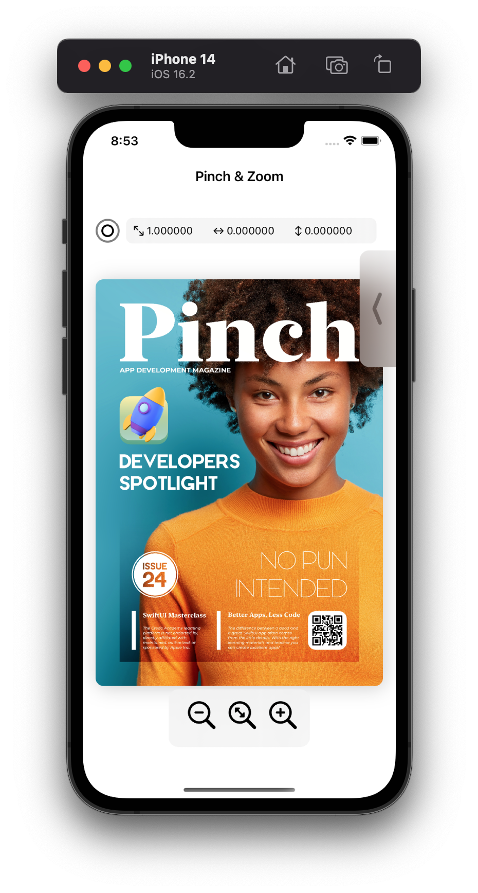
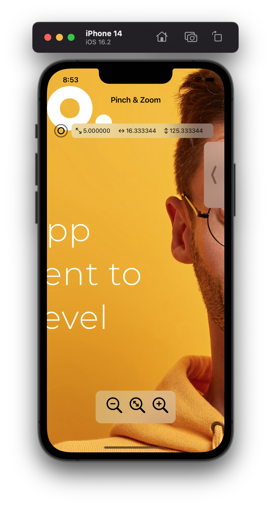

## About the project

This project demonstrates gestures within the SwiftUI framework by implementing the pinch and zoom feature of a image editor module. 
  <h3 align="center">Pinch</h3>

  * A combination of stacks (***HStack, VStack and ZStack***).
  * Component life cycles to implement entering and exiting animations of child components(***onAppear***).
  * ***Overlays*** for overlapping views.
  * ***DragGesture***, ***TapGesture***, ***LongTapGesture*** and ***MagnificationGesture** to perform respective tasks on the image.
  * Various animations (***spring, easeout*** ...).
  * ***@State*** property wrapper to achive UI update and animations.

### Views

  
  
 

 https://user-images.githubusercontent.com/80220432/229659968-249275ff-171c-4156-be04-0221cb25b7fe.mov
  
  These pages were constructed using:
  

